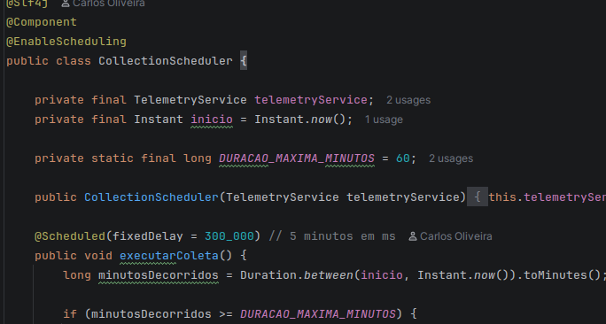
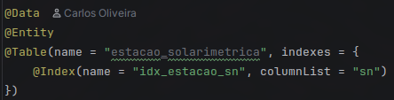
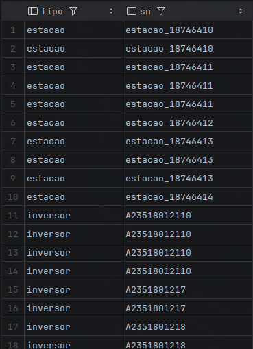

# IoT Data Consumer

Aplicação Spring Boot que consome dados de telemetria de equipamentos IoT de uma usina solar (Inversores, Relés de Proteção e Estações Solarimétricas), filtra anomalias e persiste os dados válidos em SQLite.

## Pré-requisitos

- **Java 21** (ou superior)
- **Maven 3.9+** (ou usar o `mvnw` incluso)

## Estrutura do Projeto

```
iot-data-consumer/
├── src/main/java/io/github/carlinhoshk/iot_data_consumer/
│   ├── client/ApiClient.java           # HTTP client para os endpoints
│   ├── config/AppConfig.java           # Beans de configuração
│   ├── exception/                      # Exceções customizadas
│   ├── model/dto/                      # DTOs para desserialização JSON
│   ├── model/entity/                   # Entidades JPA
│   ├── repository/                     # Repositórios JPA
│   ├── scheduler/CollectionScheduler.java  # Agendador 5/5 min
│   ├── service/TelemetryService.java   # Lógica de validação e persistência
│   └── IotDataConsumerApplication.java # Entry point
├── pom.xml
└── telemetria-60min.db                 # Gerado na execução
```

## Como Executar

### Usando o Maven Wrapper (primeira vez)

```bash
cd iot-data-consumer/
./mvnw spring-boot:run
```

Compila e executa automaticamente.

### Usando o JAR compilado 

```bash
cd iot-data-consumer/
java -jar target/iot-data-consumer-0.0.1-SNAPSHOT.jar
```

### Decisões Técnicas

Java + Spring Boot pela maturidade em tarefas agendadas (@Scheduled) e integração com JPA/Hibernate para persistência em SQLite.



Três tabelas separadas — uma por equipamento (inversor, rele_protecao, estacao_solarimetrica) — porque cada dispositivo tem campos completamente distintos. Uma tabela genérica geraria ~70% de colunas nulas.


Campos como Object nos DTOs porque a API injeta ~20% de anomalias: tipos errados, booleanos, arrays, null. Com Object, a desserialização nunca quebra — a validação real acontece no Service, que converte com segurança para Double/Integer.


Validação em camadas: ApiClient trata erros HTTP e formato, Service valida campos essenciais e detecta anomalias (zeros, tipos inválidos, dados faltantes). Cada endpoint é isolado — se um falha, os outros continuam.


Índices em sn em cada tabela para consultas eficientes por serial number.

